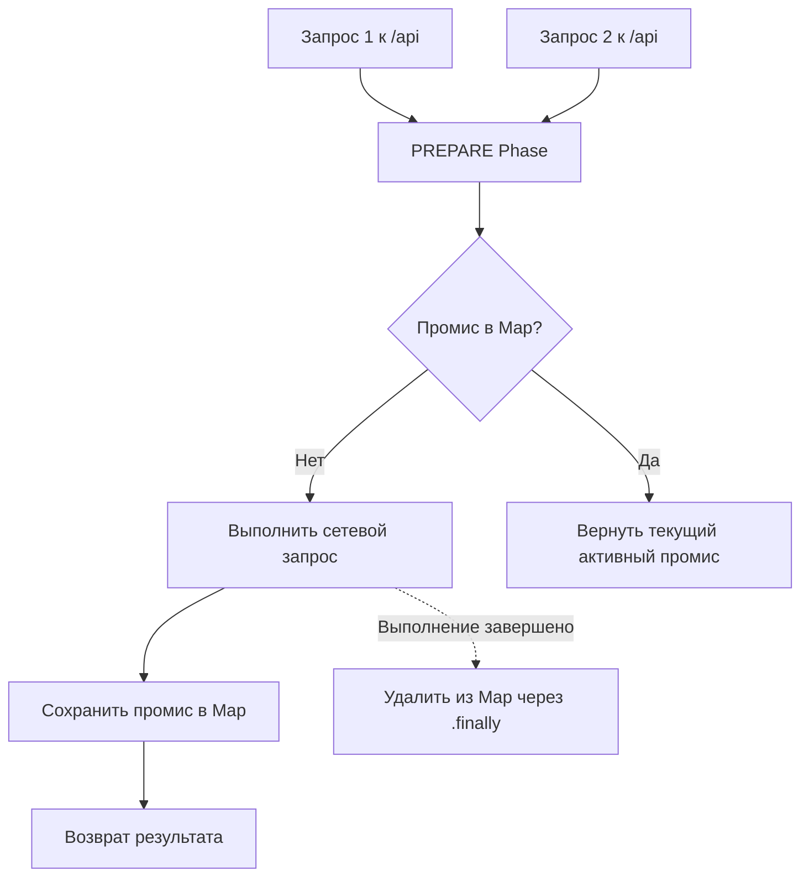

# @hyperttp/inflight

Плагин дедупликации (схлопывания) параллельных запросов для HTTP-клиента **Hyperttp**.
Если приложение одновременно выполняет несколько одинаковых
`GET`-запросов к одному и тому же эндпоинту, плагин объединяет их,
выполняет только один сетевой запрос и
распределяет единый результат между всеми вызывающими сторонами (Request Collapsing).

## Особенности

- 🏎️ **Защита от "лавины" (Cache Stampede)**:
Предотвращает перегрузку сервера идентичными конкурентными запросами.
- 🎯 **Умное освобождение памяти**:
Ссылка на промис хранится в `Map` ровно до тех пор,
пока запрос находится в обработке, и автоматически удаляется через `finally`.
- 🎛️ **Гибкое управление**:
Поддержка флага `req.meta.skipInflight` для принудительного обхода дедупликации.
- ⚡ **Нулевой оверхед**: Работает на фазе `PREPARE`,
не создает лишних оберток и не требует внешних зависимостей.

## Установка

```bash
# С использованием bun
bun add @hyperttp/inflight

# С использованием npm/pnpm
npm install @hyperttp/inflight

```

## Использование

### Инициализация клиента

Плагин по умолчанию включен (`enabled !== false`), если подключен к сборщику.
При необходимости его можно явно сконфигурировать или отключить.

```typescript
import { HyperClient } from "@hyperttp/core";

const client = new HyperClient({
  verbose: true,
  inflight: {
    enabled: true // Можно передать false, чтобы отключить плагин
  }
});

// Запросы отправляются одновременно
const [res1, res2, res3] = await Promise.all([
  client.get("https://api.example.com/slow-endpoint"),
  client.get("https://api.example.com/slow-endpoint"),
  client.get("https://api.example.com/slow-endpoint")
]);

// Вкладка Network покажет ровно ОДИН реальный HTTP-запрос.
// Все три переменные получат один и тот же результат.

```

### Обход дедупликации

Если вам необходимо гарантированно отправить отдельный сетевой запрос,
используйте свойство `meta` внутри конфигурации запроса:

```typescript
const freshData = await client.get("https://api.example.com/slow-endpoint", {
  meta: { skipInflight: true }
});

```

## Как это работает (Архитектура)

Плагин перехватывает цепочку выполнения на фазе **`PREPARE`**:



## Лицензия

MIT © dirold2
